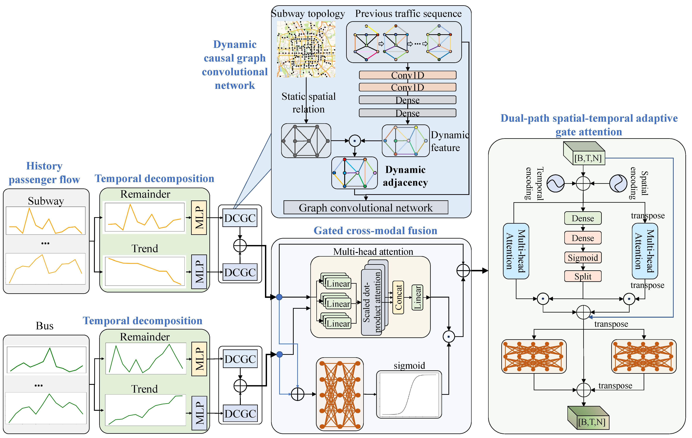

# DST-DFN
# 🚇🚌 Subway passenger flow prediction considering subway-bus transfer:A dynamic spatiotemporal decomposition and gate fusion network

---

## 📦 Environment Setup

Make sure you have the following dependencies installed:

- Python >= 3.9  
- TensorFlow ≥ 2.10  
- CUDA ≥ 11.2 (if using GPU)

Install dependencies with:

```bash
pip install -r requirements.txt
```

---

## 📊 Dataset

The dataset contains preprocessed inflow and outflow data from both subway and bus systems. These files are required to run the training and testing scripts.

### Files Description

| File Name               | Description                            |
|------------------------|----------------------------------------|
| `DT_ridership_in.npy`  | Subway inflow data                     |
| `DT_ridership_ou.npy`  | Subway outflow data                    |
| `GJ_DT_flowin.npy`     | Bus inflow data                        |
| `GJ_DT_flowou.npy`     | Bus outflow data                       |
| `DT_ADJ.csv`           | Static adjacency matrix for subway     |

Ensure the data files are placed in the correct paths as expected in the code.  
If you do not have access to the dataset, please contact the author.

---

## 🚀 Quick Start

You can run a test prediction using random input as follows:

```python
import tensorflow as tf
test_input = tf.random.normal((32, 12, 329, 2))
prediction = model.predict(test_input)
print("Prediction shape:", prediction.shape)
```

For training with real data, make sure to preprocess the data as shown in the scripts and then train using the model defined in `main_model.py`.

---

## 🧠 Overall Architecture
This is the framework of the dynamic spatial-temporal decomposition and fusion network (DST-DFN).



---

## 📮 Contact

If you have questions, issues, or suggestions, feel free to reach out:

- **Email**: liushan22@seu.edu.cn  

---

## 🧪 Project Status

This project is still **under active development**.  
We are continuously working on:

- Adding support for additional cities or data formats  
- Improving performance and efficiency  
- Providing evaluation benchmarks and metrics

Stay tuned for updates!
